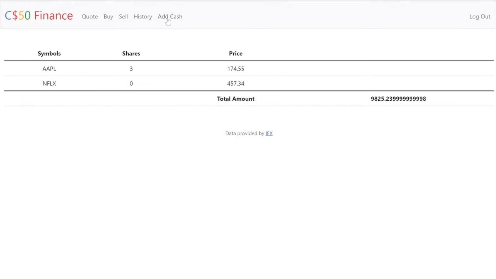

# Virtual Stock Market Platform

A fake finance website where users can buy and sell shares using a fake balance of 10,000. Users have the ability to add funds, purchase, and sell shares. Every transaction is stored in a database and displayed in a table, allowing users to track their fake financial activities.


## Features:
- **Fake Balance:** Users start with a fake balance of 10,000 that they can use to buy and sell shares.
- **Add Funds:** Ability to add more funds to the account to increase purchasing power.
- **Buy and Sell Shares:** A user-friendly interface to buy and sell shares using the available balance.
- **Database Storage:** All transactions are stored in a database to track activities.
- **Transaction Display:** All stored transactions are displayed in a well-organized table, making it easy for users to track their activities.


## Screenshots

<div style="display: flex; gap: 10px;">
  
</div>

## Contributing
If you want to contribute to this project, feel free to open issues or submit pull requests. Your feedback and contributions are highly appreciated!

## Contact
For any questions or feedback, you can reach out to me at [Hissah.khalid@hotmail.com](mailto:Hissah.khalid@hotmail.com). 

## License
 ```bash
  Copyright 2024 Hissah Khalid.
